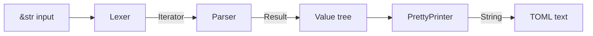

# Design Document: toml-rust-parser

## Overview

`toml-rust-parser` is a pure-Rust library that parses TOML v1.0.0 documents into a typed `Value` enum and serializes `Value` trees back into valid TOML text. The library is structured as a single Rust crate with clearly separated modules for lexing, parsing, pretty-printing, and error handling.

Design goals:
- Full conformance with the TOML v1.0.0 specification.
- Clear, actionable error messages with line/column information.
- Round-trip fidelity: `parse(pretty_print(v)) == v` for all valid `Value` trees.
- No unsafe code; no external runtime dependencies beyond `indexmap`.

---

## Architecture

The crate is organized into the following modules:

```
toml_rust_parser/
├── lib.rs          – public API surface (re-exports parse, Value, ParseError, PrettyPrinter)
├── lexer.rs        – tokenizer: &str → Iterator<Token>
├── parser.rs       – recursive-descent parser: &str → Result<Value, ParseError>
├── value.rs        – Value enum, date/time types, Table type alias
├── printer.rs      – PrettyPrinter: Value → String
└── error.rs        – ParseError type
```



Data flows in one direction: raw text → tokens → value tree → text. There is no shared mutable state between modules.

---

## Components and Interfaces

### Public API (`lib.rs`)

```rust
/// Parse a TOML document string into a Value tree.
pub fn parse(input: &str) -> Result<Value, ParseError>;

/// Serialize a Value tree into a TOML document string.
pub fn to_toml_string(value: &Value) -> String;
```

### Lexer (`lexer.rs`)

The lexer converts a `&str` into a flat stream of `Token` values. It is a zero-copy, position-tracking iterator over the input bytes.

```rust
pub struct Lexer<'a> {
    input: &'a str,
    pos: usize,   // byte offset
    line: u32,
    col: u32,
}

impl<'a> Lexer<'a> {
    pub fn new(input: &'a str) -> Self;
    pub fn next_token(&mut self) -> Result<Token<'a>, ParseError>;
    pub fn peek_token(&mut self) -> Result<&Token<'a>, ParseError>;
}
```

The lexer is lazy: it produces one token at a time on demand from the parser. This avoids materializing the full token list in memory.

### Parser (`parser.rs`)

The parser is a hand-written recursive-descent parser that consumes tokens from the lexer and builds a `Value::Table` (the root document table).

```rust
pub struct Parser<'a> {
    lexer: Lexer<'a>,
    // Tracks which keys/tables have been defined to enforce uniqueness rules.
    table_tracker: TableTracker,
}

impl<'a> Parser<'a> {
    pub fn new(input: &'a str) -> Self;
    pub fn parse(mut self) -> Result<Value, ParseError>;

    // Internal recursive methods:
    fn parse_document(&mut self) -> Result<Value, ParseError>;
    fn parse_keyval(&mut self) -> Result<(Vec<String>, Value), ParseError>;
    fn parse_key(&mut self) -> Result<Vec<String>, ParseError>;
    fn parse_value(&mut self) -> Result<Value, ParseError>;
    fn parse_string(&mut self, kind: StringKind) -> Result<String, ParseError>;
    fn parse_array(&mut self) -> Result<Value, ParseError>;
    fn parse_inline_table(&mut self) -> Result<Value, ParseError>;
    fn parse_table_header(&mut self) -> Result<(Vec<String>, HeaderKind), ParseError>;
}
```

### Table Tracker (`parser.rs` internal)

The `TableTracker` is the most complex internal component. It maintains the state needed to enforce TOML's uniqueness and mutability rules during parsing.

```rust
struct TableTracker {
    root: IndexMap<String, TrackedValue>,
    // Path to the "current" table being populated (changes with each header).
    current_path: Vec<String>,
    current_kind: CurrentTableKind,
}

enum TrackedValue {
    Defined(Value),          // fully defined, immutable
    ImplicitTable(IndexMap<String, TrackedValue>),  // created by dotted key, extensible
    ArrayOfTables(Vec<IndexMap<String, TrackedValue>>), // [[header]]
}

enum CurrentTableKind {
    Root,
    StandardTable,
    ArrayOfTablesElement,
}
```

Key resolution rules enforced by `TableTracker`:
1. A key that has been `Defined` cannot be redefined.
2. An `ImplicitTable` can be extended by dotted keys or promoted to a `StandardTable` header exactly once.
3. An `ArrayOfTables` entry can have sub-tables and sub-arrays appended to its last element.
4. An inline table, once closed, is treated as `Defined` and cannot be extended.

### Pretty Printer (`printer.rs`)

```rust
pub struct PrettyPrinter {
    output: String,
}

impl PrettyPrinter {
    pub fn new() -> Self;
    pub fn print(value: &Value) -> String;

    fn print_table(&mut self, table: &IndexMap<String, Value>, path: &[String]);
    fn print_value_inline(&mut self, value: &Value);
    fn print_array_of_tables(&mut self, key: &str, arr: &[Value], path: &[String]);
}
```

The printer uses a two-pass strategy:
1. Emit all scalar key/value pairs and inline tables at the current table level.
2. Recursively emit sub-tables and arrays-of-tables using headers.

This ensures the output is always valid TOML (headers appear before their contents, scalars are not separated from their table header by sub-table headers).

### Error Type (`error.rs`)

```rust
#[derive(Debug, Clone, PartialEq)]
pub struct ParseError {
    pub message: String,
    pub line: u32,
    pub col: u32,
}

impl std::fmt::Display for ParseError { ... }
impl std::error::Error for ParseError {}
```

---

## Data Models

### `Value` Enum (`value.rs`)

```rust
use indexmap::IndexMap;

#[derive(Debug, Clone, PartialEq)]
pub enum Value {
    String(String),
    Integer(i64),
    Float(f64),
    Boolean(bool),
    OffsetDateTime(OffsetDateTime),
    LocalDateTime(LocalDateTime),
    LocalDate(LocalDate),
    LocalTime(LocalTime),
    Array(Vec<Value>),
    Table(IndexMap<String, Value>),
}
```

`IndexMap` is used for `Table` to preserve insertion order (required by Requirement 13.2).

### Date/Time Types

All date/time types are plain structs with integer fields. No external date/time library is required; the parser validates field ranges directly.

```rust
#[derive(Debug, Clone, PartialEq, Eq)]
pub struct OffsetDateTime {
    pub date: LocalDate,
    pub time: LocalTime,
    pub offset: UtcOffset,   // minutes from UTC, range -1439..=1439, or UTC flag
}

#[derive(Debug, Clone, PartialEq, Eq)]
pub struct LocalDateTime {
    pub date: LocalDate,
    pub time: LocalTime,
}

#[derive(Debug, Clone, PartialEq, Eq)]
pub struct LocalDate {
    pub year: u16,   // 0000–9999
    pub month: u8,   // 1–12
    pub day: u8,     // 1–31
}

#[derive(Debug, Clone, PartialEq, Eq)]
pub struct LocalTime {
    pub hour: u8,        // 0–23
    pub minute: u8,      // 0–59
    pub second: u8,      // 0–60 (leap second)
    pub nanosecond: u32, // 0–999_999_999 (truncated from source, not rounded)
}

#[derive(Debug, Clone, PartialEq, Eq)]
pub enum UtcOffset {
    Z,                        // UTC / Z suffix
    Minutes(i16),             // signed minutes east of UTC
}
```

Fractional seconds are stored as nanoseconds. When the source has more than 9 fractional digits, the excess is truncated (not rounded), per Requirement 8.6.

### Token Types (`lexer.rs`)

```rust
#[derive(Debug, Clone, PartialEq)]
pub enum Token<'a> {
    // Structural
    Equals,
    Dot,
    Comma,
    Newline,
    Eof,
    LBracket,
    RBracket,
    DoubleLBracket,
    DoubleRBracket,
    LBrace,
    RBrace,

    // Literals (carry their raw source slice for deferred processing)
    BareKey(&'a str),
    BasicString(String),          // escape-processed at lex time
    LiteralString(&'a str),       // raw slice, no processing needed
    MlBasicString(String),        // escape-processed at lex time
    MlLiteralString(&'a str),     // raw slice
    Integer(i64),
    Float(f64),
    Boolean(bool),
    OffsetDateTimeToken(OffsetDateTime),
    LocalDateTimeToken(LocalDateTime),
    LocalDateToken(LocalDate),
    LocalTimeToken(LocalTime),
}
```

String escape processing and numeric parsing happen inside the lexer so the parser only deals with already-validated values.

---

## Lexer Design

The lexer operates character-by-character over the UTF-8 input. It maintains a byte position and a (line, col) cursor for error reporting.

### Tokenization Strategy

1. **Skip whitespace** (space, tab) at the start of each token.
2. **Dispatch on the first character**:
   - `#` → skip to end of line (comment), emit `Newline` or continue.
   - `\n` / `\r\n` → emit `Newline`, advance line counter.
   - `"` → basic string or multi-line basic string.
   - `'` → literal string or multi-line literal string.
   - `[` → check for `[[` (double bracket) or single `[`.
   - `]` → check for `]]` or single `]`.
   - `{` / `}` / `=` / `.` / `,` → single-character tokens.
   - `t` / `f` → attempt boolean (`true` / `false`).
   - `i` / `n` → attempt float special value (`inf`, `nan`).
   - `+` / `-` → numeric literal (integer or float).
   - `0`–`9` → integer, float, or date/time (disambiguated by lookahead).
   - `A`–`Z`, `a`–`z`, `_`, `-` → bare key.
   - EOF → emit `Eof`.

### Date/Time Disambiguation

A token starting with a digit is a date/time if it matches the pattern `DDDD-DD` (year-month separator). The lexer reads ahead to determine whether the token is:
- `YYYY-MM-DD` followed by `T` or space and time → `OffsetDateTime` or `LocalDateTime`.
- `YYYY-MM-DD` alone → `LocalDate`.
- `HH:MM:SS` → `LocalTime`.
- Otherwise → integer or float.

### String Processing

Basic strings and multi-line basic strings are processed at lex time:
- Escape sequences are validated and replaced with their Unicode equivalents.
- `\uXXXX` and `\UXXXXXXXX` are validated as Unicode scalar values.
- Control characters (except tab in basic strings, and tab/LF/CR in multi-line) cause a `ParseError`.

Literal strings are returned as raw `&str` slices (no allocation needed).

---

## Parser Design

The parser is a single-pass recursive-descent parser. It maintains a `TableTracker` to enforce TOML's structural rules.

### Top-Level Loop

```
parse_document:
  loop:
    skip newlines
    peek next token:
      Eof          → done
      LBracket     → parse_table_header → set current table in tracker
      DoubleLBracket → parse_aot_header → append element in tracker
      _            → parse_keyval → insert into current table via tracker
```

### Key Parsing

Keys are parsed as `Vec<String>` (the dot-separated segments). A single bare or quoted key produces a one-element vector. Dotted keys produce multiple segments.

```
parse_key:
  segments = [parse_simple_key()]
  while peek == Dot:
    consume Dot
    segments.push(parse_simple_key())
  return segments
```

### Value Parsing

Values are dispatched on the next token:

| Token | Value type |
|---|---|
| `BasicString` / `LiteralString` / `MlBasicString` / `MlLiteralString` | `Value::String` |
| `Integer` | `Value::Integer` |
| `Float` | `Value::Float` |
| `Boolean` | `Value::Boolean` |
| `OffsetDateTimeToken` | `Value::OffsetDateTime` |
| `LocalDateTimeToken` | `Value::LocalDateTime` |
| `LocalDateToken` | `Value::LocalDate` |
| `LocalTimeToken` | `Value::LocalTime` |
| `LBracket` | `parse_array` |
| `LBrace` | `parse_inline_table` |

### Key Resolution and Table Tracking

When inserting a key/value pair `(segments, value)` into the current table:

1. If `segments` has one element, insert directly into the current table map. Error if the key already exists.
2. If `segments` has multiple elements, walk the path:
   - For each intermediate segment, look up or create an `ImplicitTable`.
   - If an intermediate segment resolves to a `Defined` non-table value, return a `ParseError`.
   - If an intermediate segment resolves to a `Defined` inline table, return a `ParseError` (inline tables are closed).
   - Insert the final value at the last segment.

When processing a `[table]` header with path `segments`:
1. Walk the path in the tracker.
2. Each intermediate segment must be an `ImplicitTable` or an `ArrayOfTables` (navigate to its last element).
3. The final segment must not already be `Defined` as a standard table or inline table.
4. Mark the final segment as the new current table (standard table kind).

When processing a `[[aot]]` header with path `segments`:
1. Walk intermediate segments as above.
2. The final segment must be absent or already an `ArrayOfTables` (not a standard table or static array).
3. Append a new empty `ImplicitTable` to the array.
4. Mark the new element as the current table (array-of-tables element kind).

### Inline Table Parsing

Inline tables are parsed fully within `parse_inline_table`. The result is a `Value::Table` that is immediately marked as `Defined` (closed). No trailing comma is allowed. No newlines are allowed between `{` and `}`.

### Array Parsing

Arrays allow mixed types, trailing commas, and newlines/comments between elements. The parser collects elements into a `Vec<Value>` and returns `Value::Array`.

---

## Pretty Printer Design

The pretty printer serializes a `Value::Table` (the root) into a TOML document string. It uses a recursive strategy with a path context to generate correct headers.

### Algorithm

```
print_table(table, path):
  // Phase 1: emit scalars and inline tables
  for (key, value) in table:
    if value is scalar or Array(non-table elements) or inline-eligible Table:
      emit "key = <inline_value>\n"

  // Phase 2: emit sub-tables
  for (key, value) in table:
    if value is Table:
      new_path = path + [key]
      emit "[" + format_path(new_path) + "]\n"
      print_table(value, new_path)

  // Phase 3: emit arrays of tables
  for (key, value) in table:
    if value is Array of Tables:
      for element in array:
        new_path = path + [key]
        emit "[[" + format_path(new_path) + "]]\n"
        print_table(element, new_path)
```

A `Table` value is "inline-eligible" if it appears as an element of an array (since TOML does not allow `[header]` syntax inside arrays). In that case it is emitted as `{ key = val, ... }`.

### Key Formatting

Keys are emitted as bare keys when all characters are in `[A-Za-z0-9_-]`, otherwise as basic-string quoted keys.

### Value Formatting (inline)

| Value | Format |
|---|---|
| `String` | `"..."` with escape sequences for special chars |
| `Integer` | decimal, no leading zeros |
| `Float` | decimal with fractional part; `inf`, `-inf`, `nan` for specials |
| `Boolean` | `true` / `false` |
| `OffsetDateTime` | RFC 3339 with `T` separator |
| `LocalDateTime` | RFC 3339 without offset |
| `LocalDate` | `YYYY-MM-DD` |
| `LocalTime` | `HH:MM:SS[.nnnnnnnnn]` (trailing zeros trimmed) |
| `Array` | `[ v1, v2, ... ]` |
| `Table` | `{ k = v, ... }` |

---

## Error Handling

All errors are returned as `Result<_, ParseError>`. The library never panics on invalid input.

### Error Categories

| Category | Example message |
|---|---|
| Encoding | `"invalid UTF-8 byte at line 1, col 5"` |
| Unexpected token | `"expected value, found newline at line 3, col 8"` |
| Duplicate key | `"duplicate key 'name' at line 5, col 1"` |
| Invalid escape | `"invalid escape sequence '\\q' at line 2, col 14"` |
| Invalid unicode scalar | `"\\uD800 is not a valid Unicode scalar value at line 2, col 5"` |
| Integer overflow | `"integer value 9999999999999999999 out of i64 range at line 4, col 3"` |
| Invalid date/time | `"invalid date '1979-13-01' at line 7, col 8"` |
| Structural violation | `"cannot extend inline table 'point' at line 9, col 1"` |
| Trailing content | `"expected newline or EOF after value at line 1, col 12"` |

### Error Propagation

The `?` operator is used throughout. The lexer and parser both return `Result<_, ParseError>`. The first error encountered terminates parsing (Requirement 15.5).

### `ParseError` implements `std::error::Error`

This allows callers to use `Box<dyn Error>` or `anyhow` ergonomically.

---

## Correctness Properties

*A property is a characteristic or behavior that should hold true across all valid executions of a system - essentially, a formal statement about what the system should do. Properties serve as the bridge between human-readable specifications and machine-verifiable correctness guarantees.*

Property-based testing is appropriate for this feature. The parser and pretty printer are pure functions over structured data with a large input space. Universal properties (round-trips, invariants, error conditions) can be verified across hundreds of randomly generated inputs cost-effectively.

The chosen PBT library is **`proptest`** (crate `proptest`), which is the standard property-based testing library in the Rust ecosystem.

Each property test is configured to run a minimum of 100 iterations.

---

### Property 1: Parse-Print Round Trip

*For any* valid `Value` tree, serializing it with the pretty printer and then parsing the result SHALL produce a `Value` tree equivalent to the original.

**Validates: Requirements 4.1, 4.5, 13.1, 13.2, 13.3, 14.4**

---

### Property 2: Whitespace Invariance

*For any* valid TOML key/value pair or dotted key, adding or removing ASCII whitespace (spaces and tabs) around the `=` sign, around `.` separators in dotted keys, or around table header brackets SHALL produce a `Value` tree equivalent to the one parsed without the extra whitespace.

**Validates: Requirements 1.4, 3.6, 10.3**

---

### Property 3: LF/CRLF Equivalence

*For any* valid TOML document using LF line endings, replacing every LF with CRLF SHALL produce a `Value` tree equivalent to the original.

**Validates: Requirements 1.5**

---

### Property 4: Comments Are Transparent

*For any* valid TOML document, appending `# <arbitrary text without control characters>` to the end of any line SHALL produce a `Value` tree equivalent to the one parsed without the comment.

**Validates: Requirements 2.1**

---

### Property 5: Duplicate Definition Rejection

*For any* valid key string or table header path, constructing a TOML document that defines the same key or table header more than once in the same scope SHALL cause the parser to return a `ParseError`.

**Validates: Requirements 3.7, 3.9, 10.4, 10.5**

---

### Property 6: Invalid Escape Rejection

*For any* basic string containing either (a) a `\` followed by a character not in `{b, t, n, f, r, ", \, u, U}`, or (b) a `\uXXXX` / `\UXXXXXXXX` sequence encoding a Unicode surrogate or a value above U+10FFFF, the parser SHALL return a `ParseError`.

**Validates: Requirements 4.2, 4.3**

---

### Property 7: Integer Overflow Rejection

*For any* decimal integer literal whose numeric value is outside the range [-2^63, 2^63-1], the parser SHALL return a `ParseError`.

**Validates: Requirements 5.11**

---

### Property 8: Underscore Separator Invariance

*For any* valid integer or float literal, inserting underscores between (non-adjacent) digit characters SHALL produce the same `Value::Integer` or `Value::Float` as the literal without underscores.

**Validates: Requirements 5.8, 6.4**

---

### Property 9: Inline Table Immutability

*For any* inline table definition, any subsequent attempt to add keys or sub-tables to that table (via a `[header]`, `[[header]]`, or dotted key outside the braces) SHALL cause the parser to return a `ParseError`.

**Validates: Requirements 11.5, 11.6**

---

### Property 10: Array of Tables Append Semantics

*For any* N >= 1 occurrences of `[[key]]` headers with the same key path in a document, the value at that key SHALL be a `Value::Array` of length N where every element is a `Value::Table`.

**Validates: Requirements 12.1, 12.2, 13.3**

---

### Property 11: Static Array Append Rejection

*For any* key assigned a static array value (including an empty array), a subsequent `[[key]]` header in the same document SHALL cause the parser to return a `ParseError`.

**Validates: Requirements 12.5**

---

### Property 12: Fractional Second Truncation

*For any* date/time literal with more than 9 fractional second digits, the parsed `nanosecond` field SHALL equal the integer formed by taking the first 9 fractional digits (right-padded with zeros if fewer than 9 are present), not the rounded value.

**Validates: Requirements 8.6**

---

## Testing Strategy

### Dual Testing Approach

Both unit tests and property-based tests are used:

- **Unit tests** cover specific examples, known edge cases from the TOML spec, and error conditions with exact expected messages.
- **Property tests** verify universal invariants across randomly generated inputs.

### Unit Test Coverage

- One test per acceptance criterion that is classified as EXAMPLE or EDGE_CASE.
- Spec-provided invalid TOML examples (e.g., duplicate keys, invalid floats, inline table extension) each get a dedicated test asserting `parse` returns `Err`.
- Spec-provided valid TOML examples each get a test asserting the correct `Value` tree.

### Property Test Configuration

Using `proptest`:

```rust
proptest! {
    #![proptest_config(ProptestConfig::with_cases(256))]

    #[test]
    // Feature: toml-rust-parser, Property 1: parse-print round trip
    fn prop_round_trip(value in arb_value()) {
        let printed = to_toml_string(&value);
        let reparsed = parse(&printed).unwrap();
        prop_assert_eq!(value, reparsed);
    }
}
```

Each property test is tagged with a comment in the format:
`// Feature: toml-rust-parser, Property N: <property text>`

### Generators

Custom `proptest` strategies are needed for:

- `arb_value()` — generates arbitrary `Value` trees (bounded depth to avoid stack overflow).
- `arb_string()` — generates arbitrary Unicode strings including edge cases (empty, whitespace-only, control characters, multi-byte sequences).
- `arb_integer()` — generates `i64` values including `i64::MIN`, `i64::MAX`, 0, and random values.
- `arb_float()` — generates `f64` values including `±inf`, `nan`, `±0.0`, and random finite values.
- `arb_datetime()` — generates valid `OffsetDateTime`, `LocalDateTime`, `LocalDate`, `LocalTime` values.
- `arb_table()` — generates `IndexMap<String, Value>` with valid TOML key strings.

### Integration Tests

A `tests/` directory contains TOML files from the [toml-test](https://github.com/toml-lang/toml-test) suite (valid and invalid cases) run as integration tests to verify spec conformance end-to-end.
